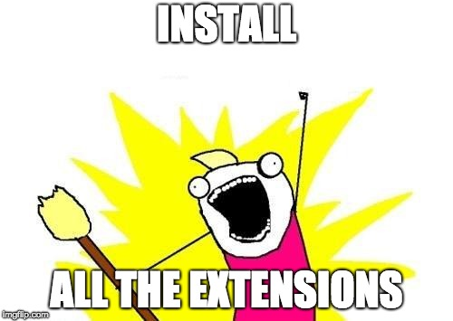

In this article I will talk about using VS Code Editor if you want to contribute to the core [Gatsby project](https://github.com/gatsbyjs/gatsby). We'll learn how to easily configure the Editor to make development easier and help ensure your Pull Requests are ✅ and get accepted. That being said everything mentioned here can be applied to just about _any_ JavaScript project.

## Editors - Make Your Selection


I know that there are as many choices for IDE editors and personal preferences as there are JS frameworks in existence (hint LOTS). I am not going to debate those here, this article will focus on [VS Code](https://code.visualstudio.com/). It's the editor I use and find it amazing for the Javascript and web development ecosystem. I was a long time holdout using Sublime Text, but once I gave VS Code a try I switched over within a day and haven't looked back.

## Enough Talk, Let's get Started

First thing to do is [download VS Code](https://code.visualstudio.com/download) for your given OS platform. Ater opening the Editor and getting comfortable with the various screens, you'll notice one of the main views is the [Extensions tab](https://marketplace.visualstudio.com/VSCode). This is where the rubber meets the road, as these extensions **really enhance** the capabilities and productivity you'll realize using VS Code.

## Let's Talk Extensions



OK, not quite, if you browse the list you will notice there are _A LOT_. I'm going to review some popular ones that are applicable to contributing to the Gatsby.js GitHub repo.

### 🚨 Code linting and Formatting 🚨

The main [Gatsby GitHub repo](https://github.com/gatsbyjs/gatsby) has configuration files in place already for [ESLint](https://eslint.org/) and [Prettier](https://prettier.io/). VS Code has extensions for both of these, which makes development really easy.

To get started, go to the Extensions View and [search](https://code.visualstudio.com/docs/editor/extension-gallery#_browse-for-extensions) for these plugins and press the green Install button for each. You may have to restart for the Extensions to take effect.

- [Prettier - Code formatter](https://marketplace.visualstudio.com/items?itemName=esbenp.prettier-vscode)
- [ESLint](https://marketplace.visualstudio.com/items?itemName=dbaeumer.vscode-eslint)

Now as you view, create, and modify files ESLint will display "squiggles" for warnings and errors in your files according to the existing rules already configured. You can correct any issues as you go.

For Prettier, you have two options. You can run the Format manually, by bringing up the Command Palette `CMD + Shift + P` (`Ctrl + Shift + P` on Windows), then selecting `Format Document`. This will format the currently open File.

The other option is to configure Prettier to Format on Save. You can enable the setting `editor.formatOnSave` by [editing the Preferences](https://code.visualstudio.com/docs/getstarted/settings) and applying this at the _User_, _Workspace_, or _Folder_ level.

### Other Fun Plugins

Of course once you start browsing the Extensions Marketplace you'll want to install additional plugins. Here is a short-list of _must-have_ plugins you should consider installing.

- [Babel ES6/ES7](https://marketplace.visualstudio.com/items?itemName=dzannotti.vscode-babel-coloring)
- [JSON Tools](https://marketplace.visualstudio.com/items?itemName=eriklynd.json-tools)
- [markdownlint](https://marketplace.visualstudio.com/items?itemName=DavidAnson.vscode-markdownlint)
- [Rainbow Brackets](https://marketplace.visualstudio.com/items?itemName=2gua.rainbow-brackets)
- [vscode-icons](https://marketplace.visualstudio.com/items?itemName=robertohuertasm.vscode-icons)

You can take a look at my ["dotfiles" Github](https://github.com/mikelax/dotfiles/tree/master/vscode) for a README on the VS Code Extensions I am using along with editor settings.

## 🚀 Debugging in Chrome 🚀

VS Code has a built-in debugger to enable proper runtime debugging, if you want to move past the `console.log` throughout your code. Use the following steps to be up and (debugging) in minutes.

1. Install the [Debugger for Chrome](https://marketplace.visualstudio.com/items?itemName=msjsdiag.debugger-for-chrome) Extension for VS Code.
1. In the Debug view, click the Debug Dropdown in the Panel and select the option `Add Config (projectname)`. This will create a `launch.json` file in your `.vscode` subfolder in the given project. Add the following to this file.

_NOTE_: You most likely will want to add the `.vscode` folder to your `.gitignore` file so it is not checked into source.

```json5:title=launch.json
{
  version: "0.2.0",
  configurations: [
    {
      type: "chrome",
      request: "launch",
      name: "Launch Chrome for Gatsby site",
      url: "http://localhost:8000",
      webRoot: "${workspaceFolder}",
    },
  ],
}
```

## Conclusion

In this article we have learned some of the basics about configuring and using VS Code for development on the Gatsby project. That being said, the Extensions and configuration discussed here can be applied to _any_ modern JavaScript web project that **may or may not use** Gatsby.

You may want to browse through the [VS Code Updates page](https://code.visualstudio.com/updates/) to see some of the recent features added. You'll notice they publish major updates monthly. It seems they are listening to the user community and continually adding features to the Editor and improvements to the user expereince.

If you want to get involved with Gatsby, the first thing you should do is review the existing [how to contribute guide](/docs/how-to-contribute/). That will go over the basics of checking out the project and getting set up. You can then browse the [Open Issues on Github](https://github.com/gatsbyjs/gatsby/issues).

Do you use an Extension that I missed in this tutorial? Send send a message to [@mikelax on Twitter](https://twitter.com/mikelax) to let me know.
