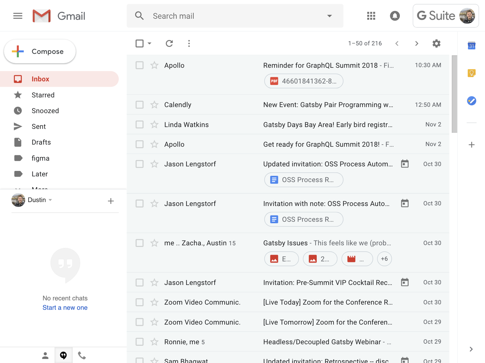
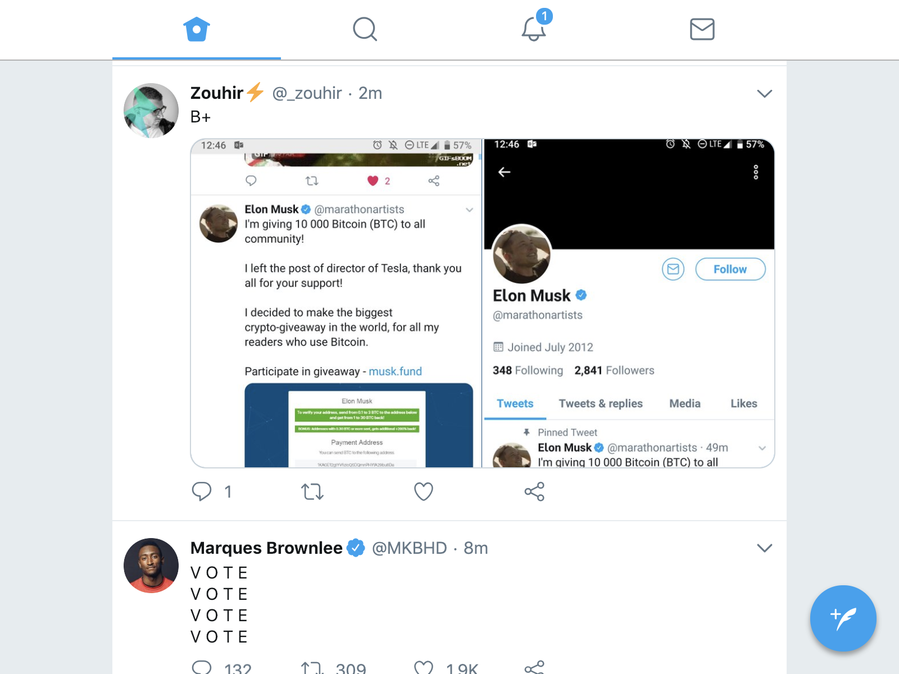
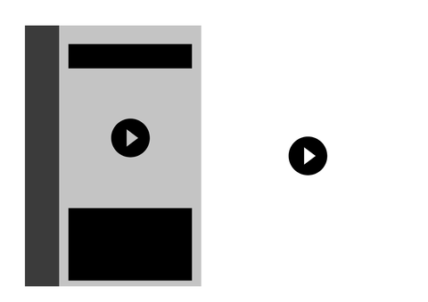
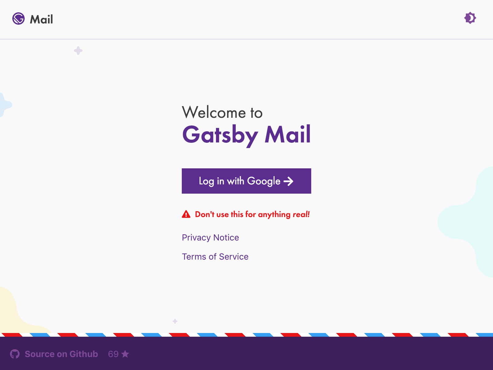
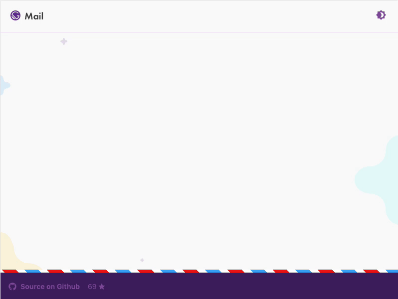

Gatsby is great for static sites. You probably know this! It’s equally great for web applications. You may not know this. Gatsby is great for building web experiences that leverage the benefits of both static sites and web applications -- at the same time. You don't have to sacrifice the advantages of one approach to reap the benefits of the other.

In this post, I will target several key areas concerning the benefits of this hybrid approach, specifically:

- What is a web application?
- Gatsby’s runtime enables dynamic functionality, which is used for dynamic, web application functionality
- Gatsby not only _can_ be used for web applications, it’s an excellent choice for web applications
- Why Gatsby for web applications?

Finally, I’ll demo a web application built with Gatsby that ties each of these key areas together and succinctly illustrate one, central point… Gatsby not only can build web applications, Gatsby is an excellent choice for your next application.

To start... what even _is_ an application, anyways?

## What is an application?

I've previously gone into the [ins and outs of describing the difficulty][whats-an-app] of defining a traditional web application. In an effort to not re-hash all the work there, I think there are several, key features that indicate a more app-like experience:

- dynamic data fetching
- user authentication and authenticated client-only routes
- client-side JS interactions

Of course, a web app isn't some checklist wherein _each_ of these functionalities are required to indicate an app-like experience. Rather, I think it's easier to _see_ an example of a web application to form a mental model of the type of web app that Gatsby can build.

For me, there are two, key examples that are at the forefront of my mental model of what constitutes a modern web application... Gmail and Twitter (Lite).

### Gmail



Gmail served as an early proof of concept that proved out two, key functional wins:

1. Client-side JavaScript can power an app-like experience, and
2. a JavaScript application (running in your browser) can compare favorably to traditional, native applications for desktop and mobile

The impact of these wins can’t be understated. It _proved_ that a native, app-like experience is not only possible for end users, but that it can even be preferable and more convenient than the native experience.

Next up, is Twitter, for slightly different reasons.

### Twitter (Lite / Progressive Web Application)



Twitter is another key example of my mental model for what an application _is_ (and can be!) because it both:

- illustrates some of the power of the modern web experience, and
- uses some great performance optimizations and smart engineering practices to serve up an engaging, fast, app-like experience

In particular, I find the following functionalities of Twitter Lite as key determinants for a separate kind of application:

- Aggressive data caching and fast page navigation with service workers
- Integration of the [PRPL pattern][prpl] (**P**ush, **R**ender, **P**re-cache, and **L**azy load)
- The illustration of the [App Shell][app-shell] pattern to speed up repeat visits and show a maximally visually complete page

These _modern_ concepts, coupled together, serve as a key marker for the value of Twitter Lite's approach to an app-like experience. They were able to strip down the core Twitter experience and deliver a blazing-fast modern web application utilizing some great engineering techniques and patterns. To learn more about these techniques, check out this great [case study][case-study].

These two, great applications will serve as key foundational pieces to keep in mind as the discussion now slightly pivots to Gatsby for web applications.

## Gatsby for Apps


What if I told you... that using a Gatsby application enables all of these traditional web-app like experiences because a Gatsby _site_ is an application?

Every Gatsby application that's deployed isn't merely static. It's _as much_ static HTML rendered up-front, as possible. Then client-side JavaScript (via React!) takes over as the engine for your next, great web app experience. A quick overview of Gatsby's general build process is effective to illustrate the concept.

1. Inject pages with data (from [GraphQL][gatsby-graphql] or even [unstructured data outside of GraphQL][gatsby-unstructured])
1. Use the [ReactDOMServer.renderToString][react-dom-render-to-string] to server-side render React pages to _HTML_ files
1. Inject a runtime and helpers (like a router!) to enable app functionality
   - Gatsby _produces_ a [create-react-app][create-react-app] like experience once this runtime takes over, client-side

To illustrate the concept, let's start with a classic example... we need to fetch some data at _run-time_ rather than build-time.

```jsx:title=src/pages/tweets.js
import React from "react"

export default class Tweets extends React.Component {
  constructor(props) {
    super(props)

    this.state = {
      tweets: [],
    }
  }

  async componentDidMount() {
    const tweets = await fetch(`/some-url-to-get-tweets`).then(response =>
      response.json()
    )

    this.setState({
      tweets,
    })
  }

  render() {
    const { tweets } = this.state
    if (tweets.length === 0) {
      return <Loading>Fetching tweets</Loading>
    }
    return (
      <ul>
        {tweets.map(tweet => (
          <li key={tweet.id}>{tweet.text}</li>
        ))}
      </ul>
    )
  }
}
```

All we've done here is implement the [`componentDidMount`][cdm] method, which will fire off a request to some REST API to retrieve some data (tweets!) from a remote API. At _runtime_ our application is now fetching data, dynamically. This illustrates the effectiveness of the Gatsby + React _runtime_ and how a Gatsby application is essentially a hydrated create-react-app like experience. [React lifecycle methods][react-lifecycle-methods] are fully supported to implement whatever dynamic interaction is required, like data fetching in this example!

Consider the following animation, which mimics the end user experience. In effect, we've statically generated non-dynamic pieces (e.g. header, sidebar, etc.) and then we request additional data, on demand!


However--this is a fairly contrived, perhaps not completely real-world example. What if that REST API [requires authentication][authentication-tutorial]? What if we want [client-only routes][client-only-routes], e.g. deep linking to a specific tweet? You better believe it's possible! The central idea I want to make crystal clear is that typically app-like features are not only _possible_ with Gatsby, but intuitive and easy to implement due to the dynamic runtime enabled by default with Gatsby.

Gatsby is for building dynamic, web applications, just as it is for building static sites. At this point, this has become clear. Gatsby can be used for many of the traditional cases for web applications, including authentication, client-only routes, dynamic data fetching, and more.

It's clear that Gatsby _can_ be used for web applications. However, what hasn't been made clear is _why_ you'd reach for Gatsby as opposed to other solutions. Gatsby not only can be used for web applications, it's in fact an excellent choice for a web application.

## _Why_ Gatsby for Apps?

If we revisit some of the benefits that Gatsby provides, minimally we could create a list, like so:

- Static rendering of React components and co-located data to static HTML
- Optimizing data, images, etc. for blazing-fast performance
- Internalizing performance patterns and best practices like [PRPL][prpl], route-based code splitting, etc.

Each of these are worthy of their own blog post, but suffice to say these are _great_ functionalities that you want not only in your static site, but also in your application.

These performance optimizations aren't opt-in; they're enabled, by default. As new performance techniques and optimizations gain popularity, we can internalize these just as we have for these others optimizations currently available in Gatsby. These optimizations can then be made available to your end users merely by upgrading your version of Gatsby.

### Plugins and the Gatsby Ecosystem

One of the key, often undersold benefits of Gatsby is its highly modular architecture. Need a plugin for [sourcing data from Wordpress][gatsby-source-wordpress]? Sure, seems reasonable. Need to [transform yaml data][gatsby-transformer-yaml] into a usable, JavaScript object? Yeah, why not! Want to [stitch in a remote GraphQL API][gatsby-source-graphql] and inject the data at _build_ time? Oh, you're fancy!! Want to load optimized, responsive, blur-in images? Yep.

#### `gatsby-image`

Certainly one of my favorite components that Gatsby provides is `gatsby-image`. This component that we provide and maintain gives excellent image rendering capabilities, along with image optimizations enabled by plugins like [`gatsby-plugin-sharp`][gatsby-plugin-sharp]. These two techniques, coupled and linked together with the GraphQL API, vastly simplify the developer experience of serving optimized images, providing a number of features, including:

- Resizing large images to an optimized size for your design
- Generate multiple, mobile-friendly images using `srcset` to serve _just_ what your user needs
- Lazy load images with a blur-up technique--even using [traced SVGs][traced-svg]

`gatsby-image` is incredible. If you haven't yet integrated its capabilities into your application, I'd highly recommend taking a look! Check out our redesigned [Using Gatsby Image][using-gatsby-image] example to learn more and see some live examples.

The power of these components and plugins is immense. In a similar way that reusable components have been incredibly valuable and successful in the React ecosystem, so to are plugins and ecosystem valuable for Gatsby applications. Why reinvent the wheel when you can re-use and leverage the power of our open-source ecosystem? Using these plugins and components means less time building out infrastructure and build tooling, and more time building out your great, Gatsby application.

### The App Shell

By adding the [`gatsby-plugin-offline`][gatsby-plugin-offline] plugin, we enable a fully-featured, progressive web application that works offline and creates an app shell by registering a service worker. An app shell is essentially disparate pieces of your application (e.g. header, footer, sidebar, etc.) that are instantly available from a service worker while dynamic content is fetched in the background. This creates a great end-user experience, as the application is able to visually populate instantly, and then data loads into place on demand.

If we consider this approach, the technique looks like the following:

1. Render as much content, as possible, up front (e.g. the app shell)
1. In the background, make async data requests to load disparate pieces, e.g. load page content from an API, particularly an API with authentication

Let’s compare this approach with the server-rendered approach. Let’s consider an authenticated API call. This API call is used to populate page data before it's sent (as HTML) to the end user. We're forced to defer loading for the entire page and the bottleneck of the API response, rather than just the pieces of dynamic data from the API call.

Consider the following animation to illustrate this point. On the left, an application using a service worker and an App Shell, e.g. a Gatsby application. On the right, a server-rendered application that waits until the API call has resolved to serve the _entire_ page all at once.



The benefits of this approach are clear. Loading an application shell gives end users the impression that the page is loading more quickly, even if in comparing the two approaches, both effectively load _all_ the data after the same amount of time. This gives your users the best of both worlds... the appearance of being blazing fast and _actually_ being blazing fast with the optimizations you get, for free, with Gatsby.

To unify all these concepts, I've assembled a demo application that illustrates that rich web applications are not only _possible_ in Gatsby, but that Gatsby is a great choice to build these types of applications.

## Introducing... Gatsby Mail! (For demo purposes only!)

[][gatsby-mail-app]

This demo application encapsulates some of the concepts and themes I've been hitting upon, particularly:

1. Gmail, Twitter, et al, are key exemplars that form a mental model of a rich, web app experience
1. Gatsby provides components, plugins, etc. for delivering great experiences, including progressive web app functionality (use them!)
1. Gatsby not only _can_ build web applications, it's an excellent choice for building web applications

Additionally, the demo application shows some specific web application functionality, such as:

- Static rendering and fetching dynamic data with the client runtime
- Authentication and non-authenticated routes, e.g. a landing page (using the [React Context][react-context] API)
- GraphQL at build time and _run time_ utilizing a remote GraphQL API and [apollo-boost][apollo-boost], and
- loading an app shell with `gatsby-plugin-offline` (check out the "Fast 3G" example below!)

and some other niceties like a light/dark theme, client-only routes, and more! You can see all of these concepts unify to form this great end-user experience in the below example with a simulated fast 3G connection. The app shell (header, footer, etc.) loads into place _instantly_ as the dynamic content is fetched (from the GraphQL API!) in the background.



Check out the [Github repo][gatsby-mail-repo] to learn more about how it was built and adopt some of the techniques as you build your next, great Gatsby web **application**. We can't wait to see what you build.

<!-- TODO: add examples of Gatsby _apps_ beyond just gatsby-mail -->

[whats-an-app]: /blog/2018-10-15-beyond-static-intro/#what-is-an-app
[prpl]: https://developers.google.com/web/fundamentals/performance/prpl-pattern/
[app-shell]: https://developers.google.com/web/fundamentals/architecture/app-shell
[case-study]: https://developers.google.com/web/showcase/2017/twitter
[gatsby-graphql]: /docs/querying-with-graphql/
[gatsby-unstructured-data]: /docs/using-unstructured-data/
[authentication-data]: /docs/authentication-tutorial/
[client-only-routes]: /docs/building-apps-with-gatsby/#client-only-routes--user-authentication
[create-react-app]: https://facebook.github.io/create-react-app/
[react-dom-render-to-string]: https://reactjs.org/docs/react-dom-server.html#rendertostring
[cdm]: https://reactjs.org/docs/react-component.html#componentdidmount
[react-context]: https://reactjs.org/docs/context.html
[gatsby-plugin-offline]: /packages/gatsby-plugin-offline/
[gatsby-plugin-sharp]: /packages/gatsby-plugin-sharp/
[gatsby-transformer-yaml]: /packages/gatsby-transformer-yaml/
[prpl]: https://developers.google.com/web/fundamentals/performance/prpl-pattern/
[gatsby-mail-app]: https://gatsby-mail.netlify.com
[gatsby-mail-repo]: https://github.com/dschau/gatsby-mail
