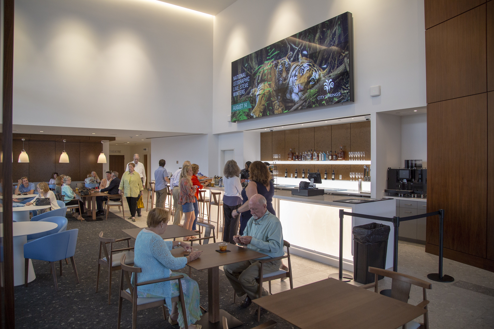
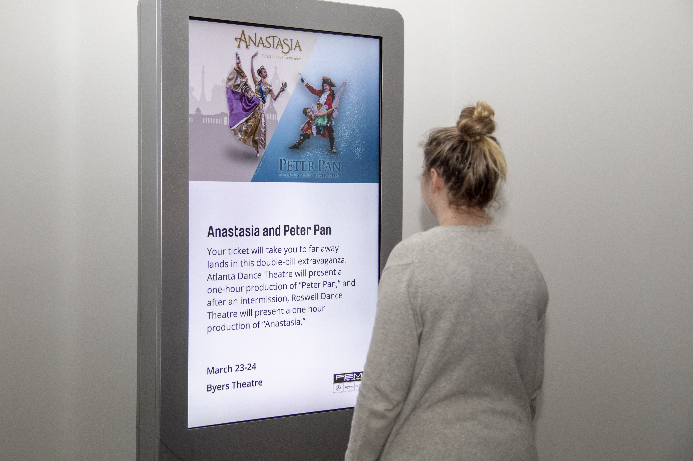

## Sandy Springs
Located north of Atlanta, Sandy Springs is a city built on creative thinking and determination. They captured a bold vision for a unified platform to bring together new and existing information systems.

To achieve their goals, the Sandy Springs communications team partnered with Mediacurrent. Together they built a new Drupal and Gatsby decoupled platform architecture to power both the [City Springs website](https://citysprings.com/) and its digital signage network.

## The Challenge
Sandy Springs needed a better way to publish messages across many content channels— including citysprings.com and digital signage. Under the existing city information system infrastructure, content is created as many as 13 separate times. City staff strained to manage infrastructure, provide user accounts, workflow, and training for each information system.

Sandy Springs came to [Mediacurrent](https://www.mediacurrent.com/?utm_source=gatsbyjs&utm_medium=blog&utm_campaign=partners2019&utm_content=mediacurrent) with a challenge: redesign an existing website to promote City Springs and use Drupal 8 to share event data with digital signage as well as other information systems in the future.

## Mediacurrent’s Solution
A decoupled approach, where front end templating is separate from the content management system and database was required to achieve a unified system. Proven as a powerful decoupled CMS, Drupal replaced the city’s existing WordPress site.

On the back end, a [Drupal 8](https://www.drupal.org/8) foundation manages content. On the front end, Gatsby presents content. With this approach, the Sandy Springs team can “create once, publish everywhere,” with a more efficient process for sharing information with the local community.

## The Decoupled Dream Team
[Gatsby](/), is instrumental to the decoupled infrastructure. The static site generator creates flat HTML, CSS, and JS files that post anywhere and load in the browser quickly. The JSON API Drupal module exposes feeds of data from the decoupled Drupal CMS to Gatsby.
In this build, Netlify deploys Gatsby. It functions to expose an API and rebuild the site as needed. When a user enters content into Drupal and promotes it to CitySprings.com, it triggers a custom Netlify build hook that tells Netlify to re-query the JSON API for new or changed data.

## Trends in Modern Web Development
In this [video presentation](https://www.youtube.com/watch?time_continue=3&v=QiocnDGnKfs) from Gatsby Days Bay Area, Mediacurrent developer Ben Robertson explains the advantages Sandy Springs has realized by leveraging Gatsby:

* **Stable**: With full control over the markup, the site build is fast.
* **Scalable**: Gatsby makes it easier for the client to add additional sites in the future.
* **Speedy**: Gatsby bakes in a lot of performance optimization for the front end, ultimately delivering a faster site.
* **Hosting**: The Drupal site is never used by a non-editorial user, so fewer hosting resources are needed.

## Final Thoughts

Today, Sandy Springs can publish content at scale, reduced training needs, and a streamlined infrastructure. Through a support agreement, Mediacurrent and Sandy Springs continue working together to achieve the city’s vision of a unified platform for all its information systems.
