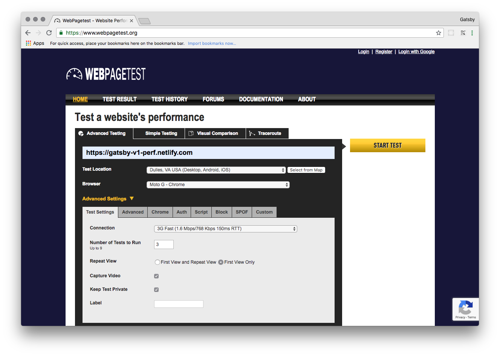

Blazing fast isn't just a marketing buzzword. There's real business value in a fast site, and whether or not your users realize it, they _want_ a blazing fast site. Gatsby is my preferred solution for making fast sites and making sites fast. Gatsby balances smart, performant defaults with excellent developer ergonomics, making it my preferred solution for creating sites that my users love. However, blazing fast isn't _just_ a goal that once hit can be lauded and bragged about. Blazing fast is something that needs to be regularly measured, understood, and improved. Each new library that's added, each new screen, each new feature runs the risk of bogging down your site, lessening the meaningful part of blazing in blazing fast. If we're _just_ fast, our competitive advantage in our speed is lost! In this post, I'll deep dive on this notion of blazing fast: how do we measure blazing fast? How did we improve upon Gatsby v1's gold standard to squeeze even more performance out of every site? What are some simple, meaningful metrics to _know_ if your site is blazing fast? Let's get to it.

> At the BBC, 10% of users are lost for every additional second the site takes to load.

## Measuring Speed

It can oftentimes be overwhelming and exhausting to truly _know_ all the performance optimizations and [web performance acronyms][web-perf] that are helpful to make your site blazing fast. H/2, PRPL, RAIL, FLIP, SPA, SW, TTI, oh my! Gatsby internalizes many of these practices so that you get _for free_ a blazing fast site with smart defaults. It's not enough to just take our word for it, though, so let's go over some performance monitoring tools so that you can learn how to measure the speed of your site and measure your site's performance. In particular, I'll go over two tools: Lighthouse and Webpagetest, and two metrics, TTI and Speed Index. Armed with the knowledge of these tangible metrics and tools you can be empowered yourself to assert whether your site is actually blazing fast or just an imposter.

### Lighthouse / Google Audit

[Lighthouse][lighthouse] is an excellent tool provided by Google Chrome. It's built into the Chrome browser itself, so there's no reason to _not_ use and explore the excellent provided functionality, so let's dive into it!

Lighthouse measures your site's speed and performance on a variety of meaningful criteria, including: performance, progessive web app functionality (e.g. service workers, offline functionality, etc.), accessibility, best practices, and search engine optimization. These core measurements, when maxed out, give strong evidence that your site is performant and following the latest web best practices.

Our baseline is going to be Gatsby v1. I've created a [repository][gatsby-v1-repo] that I've then deployed to Netlify at [this URL][gatsby-v1-netlify]. To use Lighthouse, simply open up Chrome's Developer Tools and navigate to the Audits tab, like so:

Once run, Chrome will simulate a slower 3G device, and measure the performance of your site on the criteria previously mentioned. Of particular note is the trace, which takes screenshots of your site as it loads. The less blank white screens your users see, the better. The quicker your site loads in this trace, the happier your users will be as your site is _actually_ blazing fast and a joy to use. Maximizing this trace coupled with a concept known as TTI, or Time To Interactive, means that not only does your site load fast, but that it is able to be accessed and actually _used_ quickly too. If your site shell and content loads quickly, but JavaScript and other resources are still blocking the main thread, your users will still leave your site and grow frustrated! Blazing fast isn't the appearance of loading fast, it's loading fast coupled with actually _being_ fast, and TTI is a great metric to consider as a performance baseline.

Running a performance audit on a Gatsby v1 site gives us these results in Lighthouse:

💯 Pretty speedy! We had our work cut out for us in improving upon this standard, but we did 💪

Lighthouse is an excellent tool for providing _evidence_ that your site is fast, but it does use local emulation and simulation of slow networks and slower devices, e.g. CPU throttling. However, to really _know_ that your site is fast, there's no replacing testing on a real device, which is where an excellent tool [WebPagetest][webpagetest] is valuable.

### WebPagetest

WebPagetest allows you to collect performance measurements in running on a _real_ device, e.g. a Moto G on a Fast 3G connection. In other words, it allows you to test your site with real-world devices and real-world network connections, the value of which can't be overstated! WebPagetest is to Lighthouse what end-to-end tests are to integration tests. Both are valuable, but sometimes it's nice to _know_ your web page's performance in real-world conditions, and WebPagetest provides a means to accomplish that task.

Running a test in WebPagetest will pull up the specified site on the browser/network specified, and then collect performance measurements that can be reviewed and analyzed. These tests can serve as a baseline that can be compared against after changes are made, e.g. like a change in comparing the Gatsby v1 site to the Gatsby v2 site 🤓 Additionally, it's helpful to run these tests fairly often after meaningful changes and features are added to your web site, to ensure that you're guarding against performance regressions!

[bbc]: https://www.blackbeltcommerce.com/bigcommerce/poor-website-performance/
[web-perf]: https://github.com/google/WebFundamentals/blob/master/src/data/glossary.yaml
[lighthouse]: https://www.google.com/search?q=google+audit&ie=utf-8&oe=utf-8&client=firefox-b-1-ab
[gatsby-v1-repo]: https://github.com/dschau/gatsby-v1
[gatsby-v1-netlify]: https://gatsby-v1-perf.netlify.com/
[gatsby-v2-repo]: https://github.com/dschau/gatsby-v2
[gatsby-v2-netlify]: https://gatsby-v2-perf.netlify.com/
