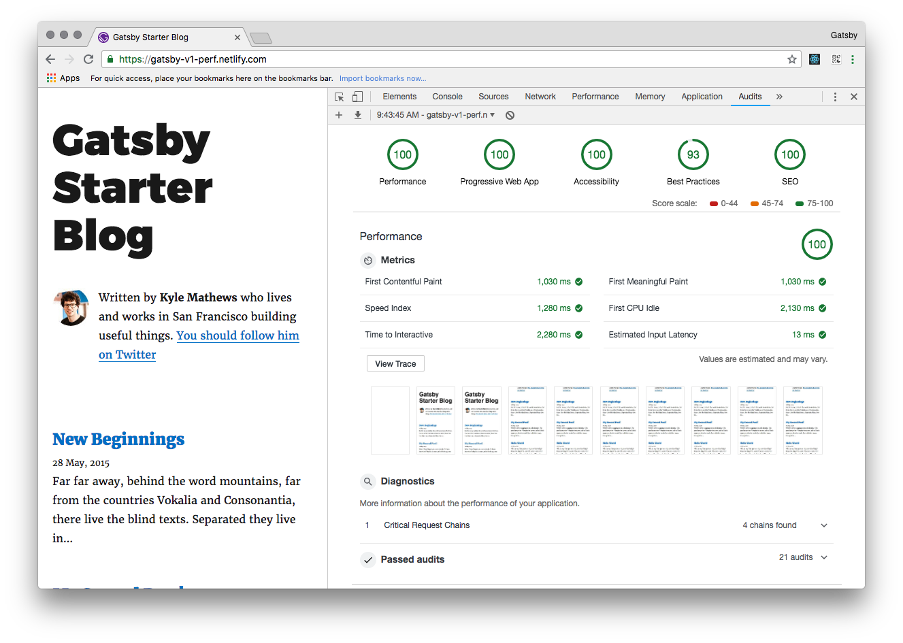
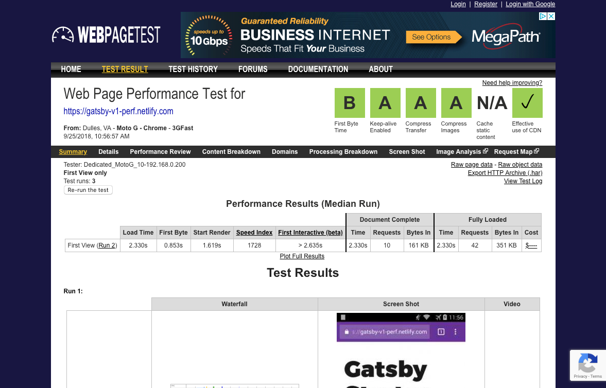
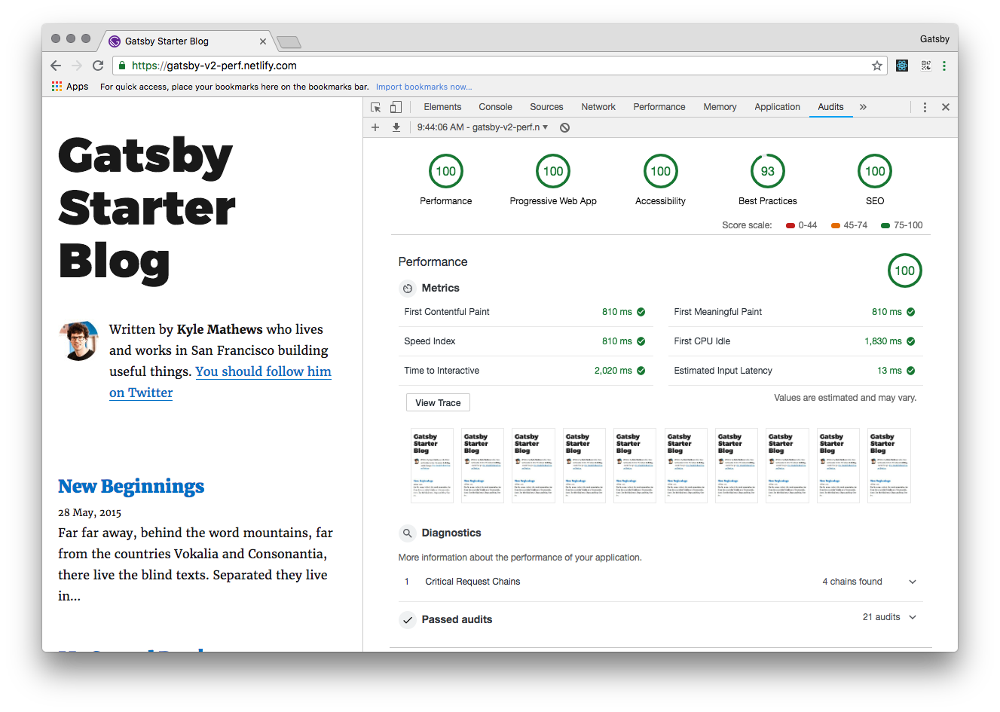
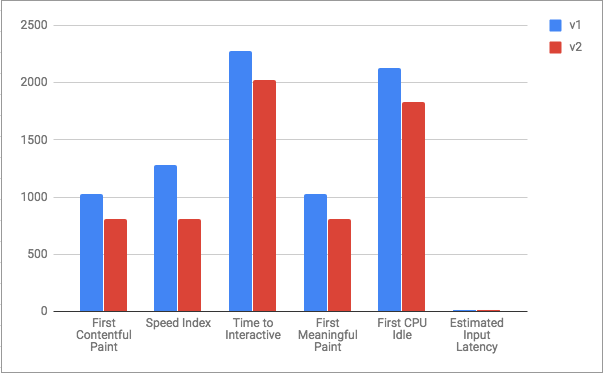
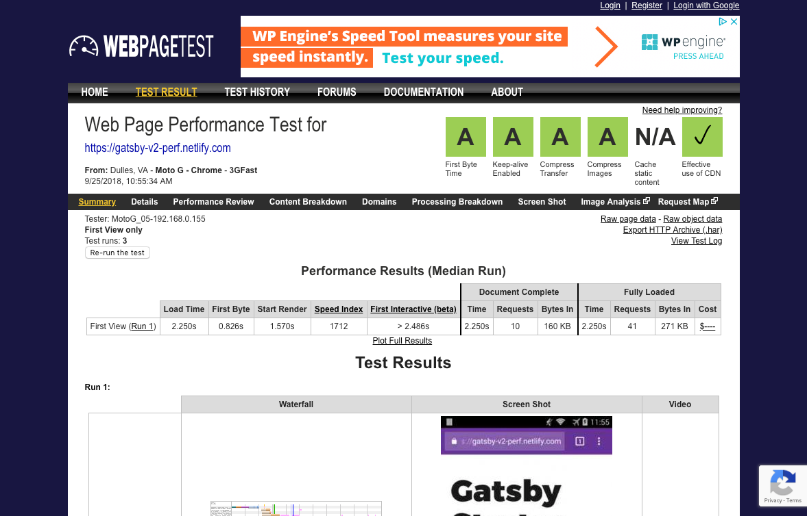

Blazing fast isn't just a marketing buzzword. There's real business value in a fast site, and whether or not your users realize it, they _want_ a blazing fast site. Gatsby is my preferred solution for making fast sites and making sites fast. Gatsby balances smart, performant defaults with excellent developer ergonomics, making it my preferred solution for creating sites that my users love. However, blazing fast isn't _just_ a goal that once hit can be lauded and bragged about. Blazing fast is something that needs to be regularly measured, understood, and improved. Each new library that's added, each new screen, each new feature runs the risk of bogging down your site, lessening the meaningful part of blazing in blazing fast. If we're _merely_ fast, our competitive advantage in our speed is lost! In this post, I'll deep dive on this notion of blazing fast: how do we measure blazing fast? How did we improve upon Gatsby v1's gold standard to squeeze even more performance out of every site? What are some simple, meaningful metrics to _know_ if your site is blazing fast? Let's get to it.

> At the BBC, 10% of users are lost for every additional second the site takes to load.

## Measuring Speed

It can oftentimes be overwhelming and exhausting to truly _know_ all the performance optimizations and [web performance acronyms][web-perf] that are helpful to make your site blazing fast. H/2, PRPL, RAIL, FLIP, SPA, SW, TTI, oh my! Gatsby internalizes many of these practices so that you get _for free_ a blazing fast site with smart defaults out of the box. It's valuable to show rather than tell, so let's go over some performance monitoring tools and techniques so that you can learn how to measure the speed of your site and measure your site's performance. In particular, I'll go over two tools: Lighthouse and Webpagetest, and two metrics, TTI and Speed Index. Armed with the knowledge of these tangible metrics and tools you can be empowered yourself to _know_ whether your site is actually blazing fast or merely an imposter.

### Lighthouse / Google Audit

[Lighthouse][lighthouse] is an excellent tool provided by Google Chrome. It's built into the Chrome browser itself, so there's no reason to _not_ use and explore the excellent provided functionality.

Lighthouse measures your site's speed and performance on a variety of meaningful criteria including: performance, progessive web app functionality (e.g. service workers, offline functionality, etc.), accessibility, best practices, and search engine optimization. These core measurements, when maximized, give strong evidence that your site is performant, following the latest web performance techniques, and you know, _actually_ fast.

Our baseline is going to be Gatsby v1. I've created a [repository][gatsby-v1-repo] that I've then [deployed to Netlify][gatsby-v1-netlify]. To use Lighthouse, simply open up Chrome's Developer Tools and navigate to the Audits tab, like so:

 <!-- Note: this probably won't work -->

Chrome will simulate a slower, mobile device, and measure the performance of your site on the criteria previously mentioned. Of particular note is the trace, which takes screenshots of your site as it loads. The less blank white screens your users see, the better. The quicker your site loads in this trace, the happier your users will be as your site is _actually_ blazing fast and a joy to use. Maximizing this trace coupled with a concept known as TTI, or Time To Interactive, means that not only does your site load fast, but that it is able to be accessed and actually _used_ quickly too. If your site shell and content loads quickly, but JavaScript and other resources are still blocking the main thread, your users will leave your site and/or grow frustrated! Blazing fast isn't just the appearance of loading fast, it's loading fast coupled with actually _being_ fast, and TTI is a great metric to consider as a performance baseline.

Running a performance audit on a Gatsby v1 site gives us these results in Lighthouse:

💯 Pretty speedy! We had our work cut out for us in improving upon this standard, but we did 💪

Lighthouse is an excellent tool for providing _evidence_ that your site is fast, and it does so by using local emulation and simulation of slow networks and slower devices, e.g. CPU throttling. However, to really _know_ that your site is fast, there's no replacing testing on a real device, which is where an excellent tool [WebPagetest][webpagetest] is valuable.

### WebPagetest

WebPagetest allows you to collect performance measurements in running on a _real_ device, e.g. a Moto G on a Fast 3G connection. In other words, it allows you to test your site with real-world devices and real-world network connections, the value of which can't be overstated! WebPagetest is to Lighthouse what end-to-end tests are to integration tests. Both are valuable, but sometimes it's nice to _know_ your web page's performance in real-world conditions, and WebPagetest provides a means to accomplish that task.

Running a test in WebPagetest will pull up the specified site on the browser/network specified, and then collect performance measurements that can be reviewed and analyzed. These tests can serve as a baseline that can be compared against after changes are made, e.g. like a change in comparing the Gatsby v1 site to the Gatsby v2 site 🤓 Additionally, it's helpful to run these tests fairly often after meaningful changes and features are added to your web site, to ensure that you're guarding against performance regressions! For your consideration, check out Gatsby v1's metrics in WebPagetest.

Armed with the powerful combo of Lighthouse, Webpagetest, and a knowledge of some useful performance terms like TTI, we can now shift into a discussion of the changes in Gatsby v2 that _improve_ performance over Gatsby v1 in meaningful, real-world ways. We'll come back to both of these tools as it relates to the Gatsby v2 site to actually _prove_ that we've improved performance over our Gatsby v1 baseline!

## Improving upon Gatsby v1

Gatsby v1 was in many ways an experiment to prove out some meaningful ideas. Injecting content at _build time_ from remote data sources with GraphQL. Statically rendering React components to HTML to maximize performance and SEO. Static site generation _and_ app-like functionality with React hydration. A pluggable and extensible architecture to augment and enhance Gatsby's base feature set and give Gatsby superpowers. [Pull data from Wordpress at build time][gatsby-source-wordpress]? Sure. [Author your application in Typescript][gatsby-plugin-typescript]? Seems reasonable. All this while maintaining sane and optimized defaults to truly squeeze every ounce of performance out of your application.

Gatsby v2 set out to build upon this solid foundation, while focusing on improvements in speed and developer experience.

### Speed improvements

It's not 🚀 science. Shipping less JavaScript to your end users makes your application faster to load, parse, and use. Think _hard_ whether that slick launch animation and heavy above the fold hero image are actually _meaningful_ to the quality experience your users want. Every additional byte of JavaScript has an associated parse and evaluation time that you're forwarding along to your end users.

> As much as I love JavaScript, it’s always the most expensive part of your site.
> -- Addy Osmani

To that end, Gatsby v2 ships 31% less JavaScript in its client runtime. While we'd _love_ to brag about this, most of the credit goes to smart optimizations in libraries we rely upon: React and @reach/router. Much like performance optimizations, build upgrades, etc. are available for free in something like [create-react-app][create-react-app], these upgrades in Gatsby v2 are available _for free_ simply by updating to Gatsby v2 by following the [migration guide][migration-guide]. The power of opinionated, optimized toolsets that internalize smart defaults!

|    Library    | Gatsby v1 | Gatsby v2 |
| :-----------: | :-------: | :-------: |
|     React     |  49.8kb   |  34.8kb   |
| @reach/router |    8kb    |    6kb    |

### Build improvements

<!-- Note: I wanted to mention these, but this will be a separate blog post, i.e. hulk smash efforts -->

Client speed (i.e. the deployed site) is of paramount importance for Gatsby and your end users. We also want our developers using Gatsby to have a great experience, and to that end, we've also made a number of tangible improvements in Gatsby v2 that we think will make using Gatsby even more enjoyable.

We've updated a number of our build dependencies, notably Webpack (1 -> 4), babel (6 -> 7), and more to gain some nice performance benefits and other optimizations. Again, it's better to show than tell, so consider the following GIF proof of the value of these efforts as it relates to developer experience:

<blockquote class="twitter-tweet" data-lang="en">
Coming soon to Gatsby v2: Ludicrous mode data hot reloading ;-)<a href="https://t.co/by1PyOYXc0">https://t.co/by1PyOYXc0</a>  (note, this gif is not sped up at all) <a href="https://t.co/hFIYMbpalN">pic.twitter.com/hFIYMbpalN</a>
&mdash; Gatsby (@gatsbyjs) <a href="https://twitter.com/gatsbyjs/status/974507205121617920?ref_src=twsrc%5Etfw">March 16, 2018</a></blockquote>

Additionally, we've been able to set a new record with our create pages benchmark, which programatically creates 100k pages and measure the performance.

<blockquote class="twitter-tweet" data-lang="en">
New speed record for <a href="https://twitter.com/gatsbyjs?ref_src=twsrc%5Etfw">@gatsbyjs</a> v2 with our &quot;create pages&quot; <a href="https://twitter.com/hashtag/benchmark?src=hash&amp;ref_src=twsrc%5Etfw">#benchmark</a>!  4.5k queries/second, 13207.88 pages/second, 75.38 seconds total build time for 100k page site <a href="https://t.co/DTH56Imzzi">pic.twitter.com/DTH56Imzzi</a>
&mdash; Andrew Rhyne (@thebigredgeek) <a href="https://twitter.com/thebigredgeek/status/1029465502358355970?ref_src=twsrc%5Etfw">August 14, 2018</a></blockquote>

To re-iterate, simply by following the [migration guide to update to Gatsby v2][migration-guide], these improvements and optimizations are available for free, simply by the process of updating!

## Bringing it home

Build optimizations, coupled with improvements in the client side runtime, have enabled some very real performance benefits and improvements in developer experience. Let's take another look at performance in Gatsby v2 by revisiting our trusty friends Lighthouse and WebPagetest. Refer to [the repo][gatsby-v2-repo] and [deployed site][gatsby-v2-netlify] to judge for yourself!

### Lighthouse

_Lower is better 😉_

### WebPagetest

## Wrap Up

Gatsby v2 is an iterative approach to improving the solid foundational base that was Gatsby v1. By simply upgrading your dependencies, and fixing a minimal amount of breaking changes, you can fully realize these performance benefits and deliver that blazing fast experience your users want, need, and should expect. You've learned some tangible ways to measure performance so you can _prove_ for yourself that your site is as fast as it should be. Onwards and upwards!

[bbc]: https://www.blackbeltcommerce.com/bigcommerce/poor-website-performance/
[web-perf]: https://github.com/google/WebFundamentals/blob/master/src/data/glossary.yaml
[lighthouse]: https://www.google.com/search?q=google+audit&ie=utf-8&oe=utf-8&client=firefox-b-1-ab
[gatsby-v1-repo]: https://github.com/dschau/gatsby-v1
[gatsby-v1-netlify]: https://gatsby-v1-perf.netlify.com/
[gatsby-v2-repo]: https://github.com/dschau/gatsby-v2
[gatsby-v2-netlify]: https://gatsby-v2-perf.netlify.com/
[gatsby-source-wordpress]: /packages/gatsby-source-wordpress
[gatsby-plugin-typescript]: /packages/gatsby-plugin-typescript
[migration-guide]: /docs/migrating-from-v1-to-v2/
