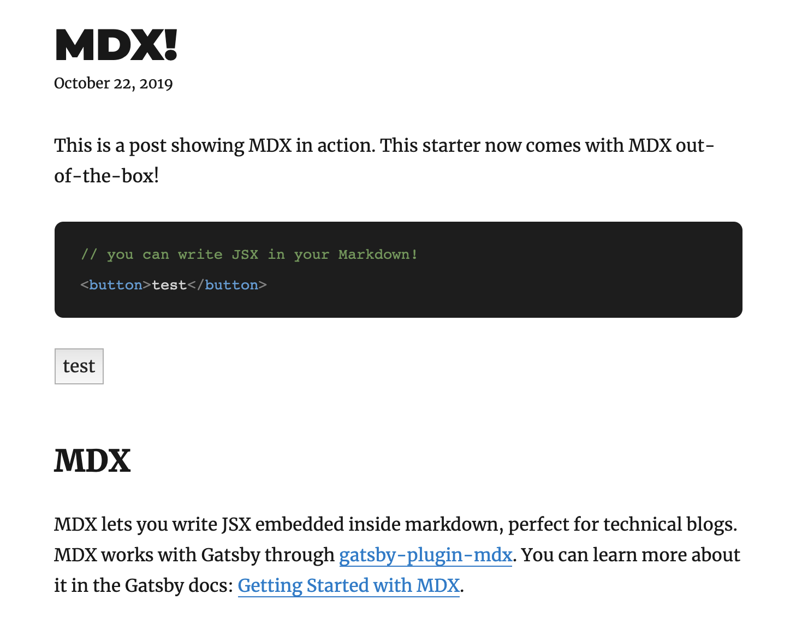

## What is MDX?

MDX is a file format that lets you add JSX to Markdown files via a `.mdx` file! It was started by and is maintained by Gatsby's [John Otander](https://github.com/johno) and the [open source community on Github](https://github.com/mdx-js/mdx).

With MDX, you can import React components and declare them alongside regular markdown syntax. This is useful to display specific component examples alongside the actual code, complex interactive components like charts, and reusable components across multiple pages like sign-up forms.

## Adding MDX to Gatsby Starter Blog

It can be a big tricky to add MDX to an existing blog. The following 5 steps will cover how to install and configure MDX to [Gatsby's blog starter](https://github.com/gatsbyjs/gatsby-starter-blog/tree/master), which as of [today's version](https://github.com/gatsbyjs/gatsby-starter-blog/tree/8852c1e51651b902f19706ff2ca9f60dabc25709), does not have MDX pre-installed.

You can also see the [full changes in PR #18929](https://github.com/gatsbyjs/gatsby/pull/18928/files) for an overview of the changes you have to make to get MDX working.

### Step 1

Install [gatsby-plugin-mdx](/packages/gatsby-plugin-mdx/), the official plugin for using MDX with Gatsby. Also, install `@mdx-js/mdx` and `@mdx-js/react`.

```
npm install --save gatsby-plugin-mdx @mdx-js/mdx @mdx-js/react
```

### Step 2

In `gatsby-config.js`, replace `gatsby-transformer-remark` with `gatsby-plugin-mdx`, along with the following changes:

```diff:title=gatsby-config.js
  {
-  resolve: `gatsby-transformer-remark`,
+  resolve: `gatsby-plugin-mdx`,
   options: {
+    extensions: [`.mdx`, `.md`],
-    plugins: [
+    gatsbyRemarkPlugins: [
       {
         resolve: `gatsby-remark-images`,
         options: {
           maxWidth: 590,
         },
       },
       {
         resolve: `gatsby-remark-responsive-iframe`,
         options: {
           wrapperStyle: `margin-bottom: 1.0725rem`,
         },
       },
       `gatsby-remark-prismjs`,
       `gatsby-remark-copy-linked-files`,
       `gatsby-remark-smartypants`,
     ],
   },
  },
```

Then, add some options to `gatsby-plugin-feed`. This will allow the the RSS feed of the site to parse MDX.

```diff:title=gatsby-config.js
- `gatsby-plugin-feed`,

+ {
+   resolve: `gatsby-plugin-feed`,
+   options: {
+     query: `
+       {
+         site {
+           siteMetadata {
+             title
+             description
+             siteUrl
+           }
+         }
+       }
+     `,
+     feeds: [
+       {
+         serialize: ({ query: { site, allMdx } }) =>
+           allMdx.edges.map(edge =>
+             Object.assign({}, edge.node.frontmatter, {
+               description: edge.node.excerpt,
+               data: edge.node.frontmatter.date,
+               url: site.siteMetadata.siteUrl + edge.node.fields.slug,
+               guid: site.siteMetadata.siteUrl + edge.node.fields.slug,
+               custom_elements: [{ "content:encoded": edge.node.body }],
+             })
+           ),
+         query: `
+         {
+           allMdx(
+             limit: 1000,
+             sort: { order: DESC, fields: [frontmatter___date] },
+           ) {
+             edges {
+               node {
+                 fields { slug }
+                 frontmatter {
+                   title
+                   date
+                 }
+                 body
+               }
+             }
+           }
+         }
+         `,
+         output: `/rss.xml`,
+         title: `Gatsby RSS feed`,
+       },
+     ],
+   },
+ },
```

### Step 3

In `gatsby-node.js`, change `allMarkdownRemark` to `allMdx` and `MarkdownRemark` to `Mdx`.

```diff:title=gatsby-node.js
# line 11
- allMarkdownRemark(
+ allMdx(

# line 35
- const posts = result.data.allMarkdownRemark.edges
+ const posts = result.data.allMdx.edges

# line 56
- if (node.internal.type === `MarkdownRemark`) {
+ if (node.internal.type === `Mdx`) {
```

### Step 4

In `src/pages/index.js`, replace `allMarkdownRemark` with `allMdx` in both the `render()` method and also the GraphQL query.

```diff:title=src/pages/index.js
# line 13
- const posts = data.allMarkdownRemark.edges
+ const posts = data.allMdx.edges

# line 59
- allMarkdownRemark(sort: { fields: [frontmatter___date], order: DESC }) {
+ allMdx(sort: { fields: [frontmatter___date], order: DESC }) {
```

### Step 5

In `src/templates/blog-post.js`, add an import statement for `MDXRenderer` from `gatsby-plugin-mdx` and replace `markdownRemark` with `mdx` in both the `render()` method and also the GraphQL query. Also, we'll be using `body` instead of `html` in our GraphQL query.

```diff:title=src/templates/blog-post.js
# line 3
+ import { MDXRenderer } from "gatsby-plugin-mdx"

# line 11
- const post = this.props.data.markdownRemark
+ const post = this.props.data.mdx

# line 41
- <section dangerouslySetInnerHTML={{ __html: post.html }} />
+ <MDXRenderer>{post.body}</MDXRenderer>

# line 93
- markdownRemark(fields: { slug: { eq: $slug } }) {
+ mdx(fields: { slug: { eq: $slug } }) {

# line 96
- html
+ body
```

And... that's it! After these changes, a Gatsby blog should be able to use MDX files to render JSX with markdown! To test, add a `.mdx` file to `content/blog/` and check if the JSX renders.

For example, the following code should render a test button.

````mdx:title=content/blog/example.mdx
---
title: MDX!
date: "2019-10-22"
description: "A post showing MDX in action"
---

This is a post showing MDX in action. This starter now comes with MDX out-of-the-box!

```js
// you can write JSX in your Markdown!
<button>test</button>
```

<button>test</button>

## MDX

MDX lets you write JSX embedded inside markdown, perfect for technical blogs. MDX works with Gatsby through [gatsby-plugin-mdx](https://www.gatsbyjs.org/packages/gatsby-plugin-mdx/). You can learn more about it in the Gatsby docs: [Getting Started with MDX](https://www.gatsbyjs.org/docs/mdx/getting-started/).
````



If you're interested in spinning up a new personal blog with MDX, I've prepared [Gatsby personal blog starter](https://github.com/thomaswangio/gatsby-personal-starter-blog) for your usage!

## Further Reading

1. [Gatsby Reference Guide on MDX](/docs/mdx/)
2. [MDX Gatsby Documentation](https://mdxjs.com/getting-started/gatsby)
