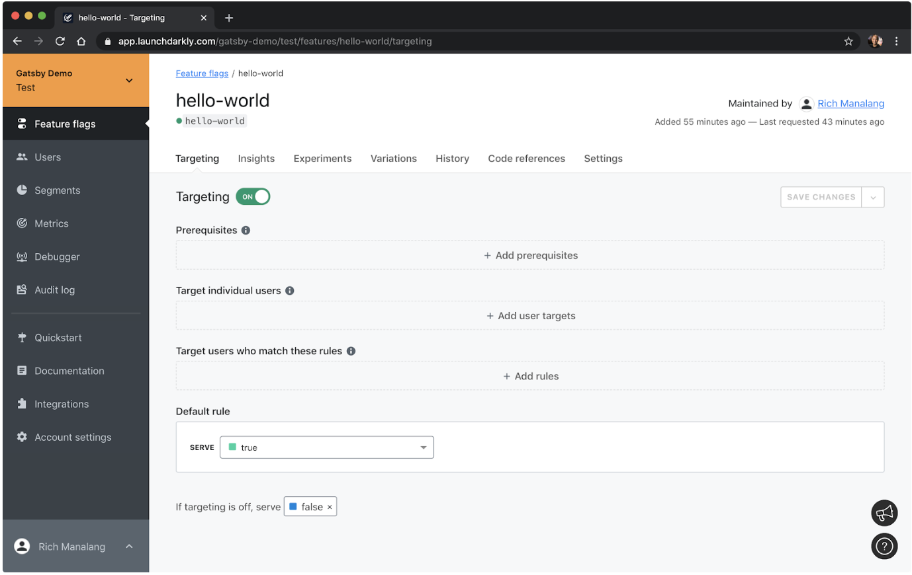

#Fly Your Feature Flags with LaunchDarkly’s New Plugin for Gatsby

***Editor's note:** This guest post is by [Rich Manalang](https://twitter.com/rmanalan), a Principal Developer Advocate at [LaunchDarkly](https://launchdarkly.com). It describes how you can use feature flags on your Gatsby sites so you can have better control of how (and when) you release features to your customers.*
 
 A few months ago we decided to migrate our [public-facing documentation site](https://docs.launchdarkly.com) from a managed documentation service to Gatsby. We wanted greater control of the site and a git-based workflow. Additional goals were to scale to a larger set of internal authors and also accept contributions from our community. During the development of this new site, we realized that it might be useful to hide certain sections of the site from certain groups of people; for example, limit access to beta users or a specified group of reviewers.

Here at [LaunchDarkly](https://launchdarkly.com/), we know a thing or two about using feature flags to control and manage the release of features. First, though, you might be wondering, [“What *are* feature flags, anyway?”](https://martinfowler.com/articles/feature-toggles.html). In simple terms, a feature flag is a decision point in your code that can change the behavior of your application. LaunchDarkly is a feature management system. It lets you ship code to production without revealing it to your customers, gradually release that code to an expanding group of customers, and easily roll back to an earlier version if you find a bug.

Our first experiment in using LaunchDarkly with our own new site was to hide navigation items that aren’t quite ready for the world to see—while still allowing a limited set of people to access those hidden pages with the direct URL. When it’s appropriate, we can toggle a flag to show those navigation items to the world instantly.

Sounds simple enough, right? There are a whole host of use cases where you might want to use feature flags on your Gatsby site:
* Gradually roll out new sections or features of your site
* Release a brand redesign across multiple properties and products by toggling a single flag, rather than coordinating manual, time-sensitive deploys
* Target specific users or user segments with the new feature
* [Experiment with an A/B/n test](https://launchdarkly.com/features/experimentation/) to find the best-performing variation of a feature

We did all of the above in on our new Gatsby-based docs site! We had such a positive outcome from combining LaunchDarkly’s feature flag capabilities with Gatsby builds that it occurred to us others might want to do the same thing. So we got to work creating a plugin to make it super simple to use feature flags with Gatsby.  

The [LaunchDarkly plugin for Gatsby](https://www.gatsbyjs.org/packages/gatsby-plugin-launchdarkly/) makes it easy to start using feature flags in any Gatsby site. This plugin is powered by the [LaunchDarkly React SDK](https://docs.launchdarkly.com/docs/react-sdk-reference). This SDK uses [server-sent events](https://en.wikipedia.org/wiki/Server-sent_events) to stream feature flag updates to your site in realtime.  With it you can control feature availability instantly without your users having to refresh the page.

Here’s a quick demo of this plugin in action:

 The example in the video shows a simple page from the Gatsby default starter using the LaunchDarkly plugin. Here’s the code:

gist:[rmanalan/]722aac404ad0c10286bfd5f3ad3d8690[#index.jsx]

https://gist.github.com/rmanalan/722aac404ad0c10286bfd5f3ad3d8690

In this example, the `flags` object returned by the `useFlags()` hook is a simple object that contains all of the client-side feature flags available in your LaunchDarkly project. As the values of these flags change, components that rely on them re-render automatically. 

Here, we’re looking for a flag called `helloWorld`. This particular `helloWorld` flag is a boolean flag, but you can create flags that are multivariate strings, integers, or even JSON.

I’ll leave it to your imagination for how you might use this, but the plugin is very flexible, and the sky’s the limit. You can use it to hide and reveal navigation items like we’re doing. You can use it to test out a new visual design.

However you use it, we’d love to hear about it.  Tweet to [@launchdarkly](https://twitter.com/launchdarkly) and [@gatsbyjs](https://twitter.com/gatsbyjs) and let us know what you think!

One last thing: [this plugin is open source](https://github.com/launchdarkly-labs/gatsby-plugin-launchdarkly). We’d love your contributions!
